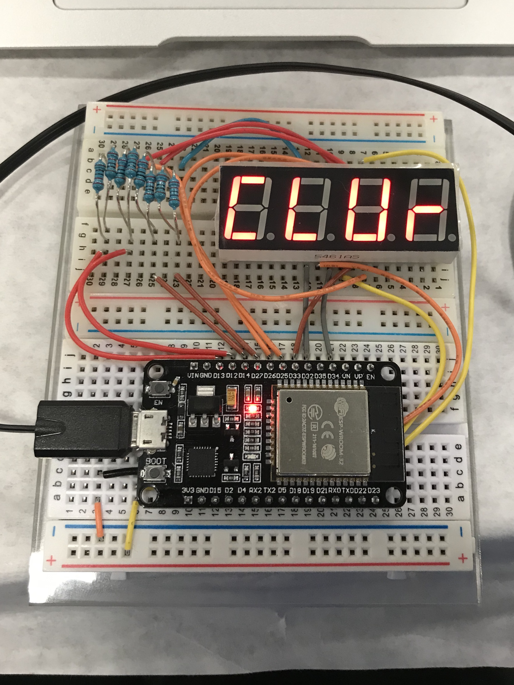

# Cube clock

## Parts

- ESP32 devkit v1
- 8 220 kOhm resistors
- seven-segment display (5461AS)

## Software dependencies

- Arduino
- ESP32 dev module support for Arduino
- [SevSeg][sevseg] library

## Related documentation

- [Using the KYX-5461AS 4-digit 7-segment LED display with Arduino][sevseg-tut]
- [How to Set up 7-Segment Displays on the Arduino][sevseg-wiring]

[sevseg]: https://github.com/DeanIsMe/SevSeg
[sevseg-tut]: http://thomas.bibby.ie/using-the-kyx-5461as-4-digit-7-segment-led-display-with-arduino/
[sevseg-wiring]: http://www.circuitbasics.com/arduino-7-segment-display-tutorial/